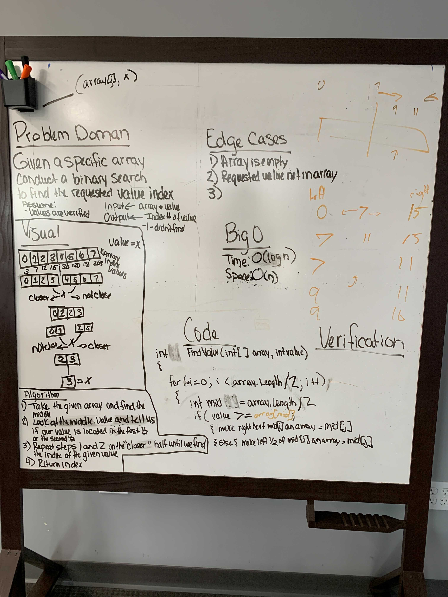

## Code Challenge:  Class 03 - Array Binary Search
# Using a Binary Search on an Array
We were given a specific array and asked to find the index for a given value.

## Whiteboard Process

## Approach & Efficiency
We went with the approach of taking the original array, find the mid point value, compare the value we were given to find against it, and then if that midpoint value was larger than the value we were given, we would conduct a search of only the left side of the original array.  If the midpoint value was smaller than the value we were searching for, we would only search the right side of the original array.  We would continue to find the midpoint values of the remaining arrays and search the array between the value that was lower than our value and higher than our value.  The Binary Search does seem more efficient than say a bubble search, but definitely a bit of work.