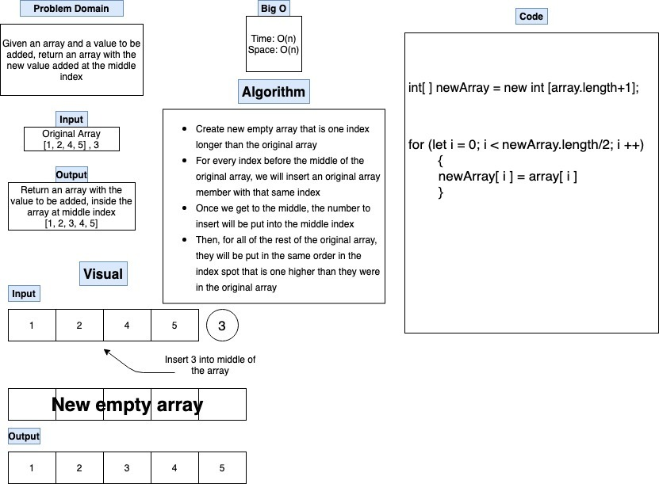

## Code Challenge:  Class 02 - Array Insert Shift
# Insert Shift Array
We were given a specific array and asked to insert an element into the middle of that array without using any known methods.

## Whiteboard Process

## Approach & Efficiency
Not knowing how big the original array was, we determined that  we would need to take the original array and create a new, empty array that contained one more element than the original.  Then, using a for loop, we would insert each member of the original array into the new array UP TO the middle of the original array.  At that point, we would insert the newly item and then continue adding elements from the original array, but at their original index + 1.  We were not completely sure on which all methods to use to insert the new element and the rest of the original array.