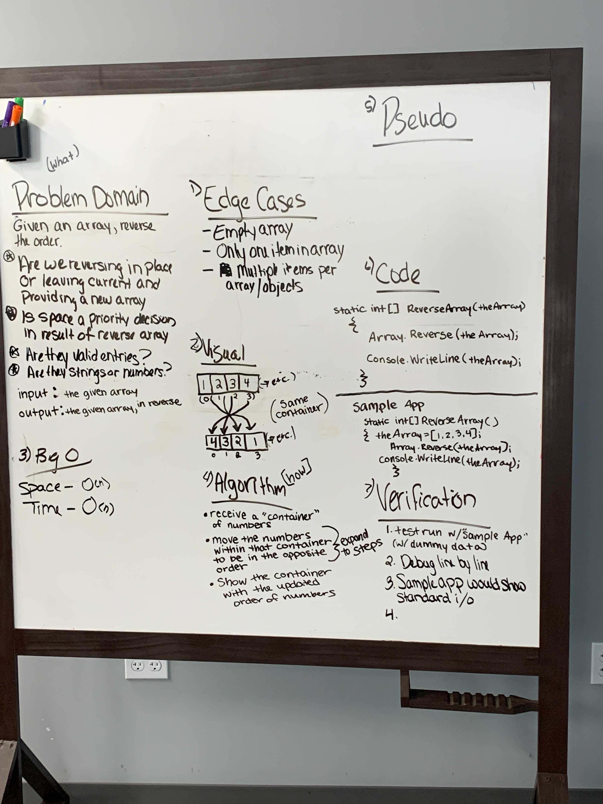

## Code Challenge:  Class 01 - Array Reverse
# Reverse an Array
We were given a specific array and asked to reverse it in place.

## Whiteboard Process

## Approach & Efficiency
We assumed the array was all numbers and we used the Array.Reverse method in C# to take the original array and exactly reverse the order of the that array in the same space.  Had we had it to do again, we would not have used the method.  We would have used a for loop to move two items at a time.