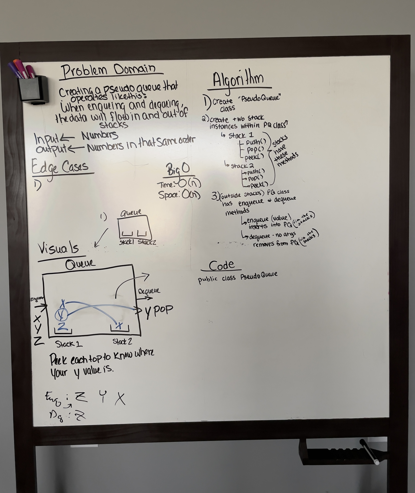
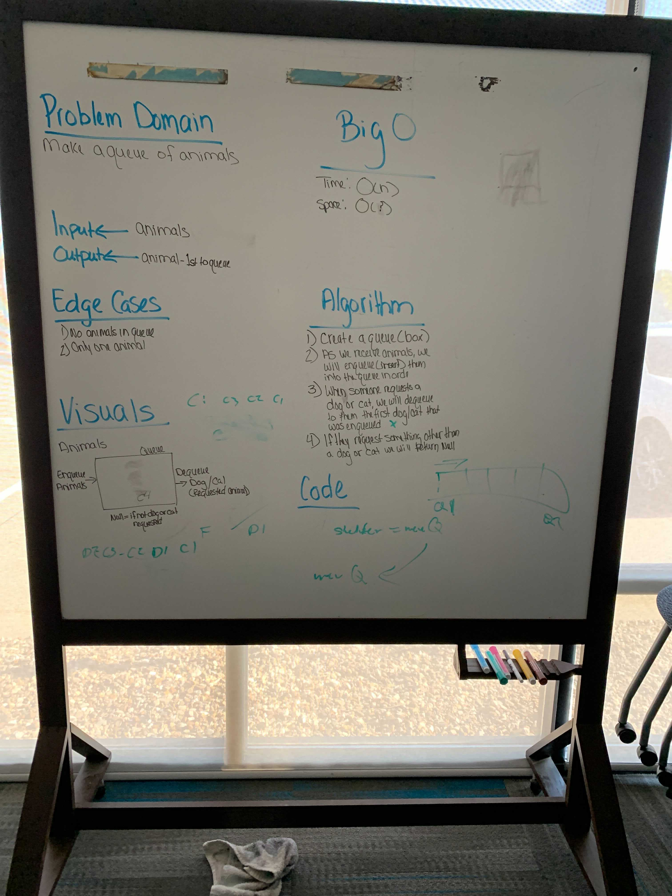
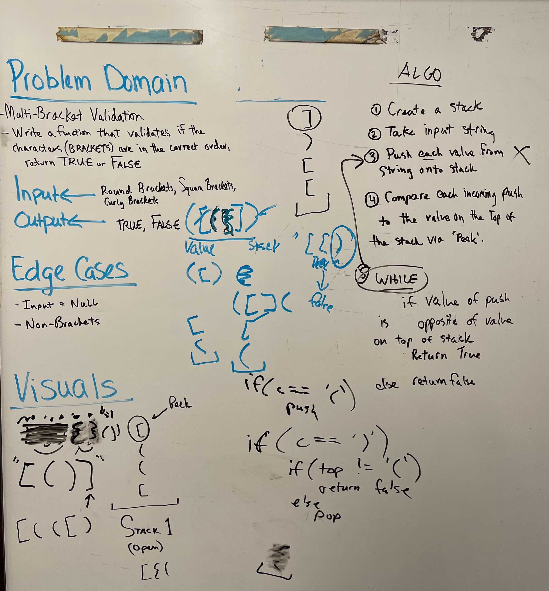

## Code Challenge:  Class 11 - Stack and Queue Pseudo

We will be creating a a pseudo queue using stacks.

## Challenge
We need to create two stacks with the methods push, pop, and peek that process enqueue and dequeue processes through them.

## Approach & Efficiency

Dealing with a stack:
Time:  O(n)
Space: O(n)

## API
<!-- Description of each method publicly available to your Linked List -->

## Code Challenge:  Class 12 - Stack and Queue Animal Shelter

We need to create a queue to hold animals.

## Challenge
We need to create a queue that will allow us to hold both animal and dogs in the order they came in and then dequeue the first of that dog/cat that arrived at the shelter.

## Approach & Efficiency

Dealing with a stack:
Time:  O(n)
Space: O(n)

## API
<!-- Description of each method publicly available to your Linked List -->

## Code Challenge:  Class 13 - Stack Queue Brackets

We need to create a queue to use to verify that a set of values received for brackets have open and closing in the correct order.

## Challenge
We need to create a queue that will allow us to compare the sets of brackets as each individual bracket is revealed.

## Approach & Efficiency

Dealing with a stack:
Time:  O(n)
Space: O(n)

## API
<!-- Description of each method publicly available to your Linked List -->

## Code Challenge:  Class 15 - Trees
We need to create a Binary Tree and a Binary Search Tree.

## Challenge
We need to create our trees and include methods for each depth first traversal - pre-order, in-order, and post-order as well as the required tests.

## Approach & Efficiency

Pre-Order:
	- Time: O(h)
	- Space: O(1)

In-Order:
	- Time: O(h)
	- Space: O(1)

Post-Order:
	- Time: O(h)
	- Space: O(1)

## API
<!-- Description of each method publicly available to your Linked List -->

## Code Challenge:  Class 17 - Trees - Breadth First

We have a tree and need to provide the values back in order.

## Challenge
We need to traverse our tree and track each of the values that we come to in the order that we encounter them.  We will work starting at the root and then go to the first left and straight over to the first right.  Once that is done, we go back to the left directly below the first left, record that value and then to the nodes directly to the right of that node on the same level.  We repeat until we reach the bottom of the tree where there are no more values.

## Approach & Efficiency

- Time: O(n)
- Space: O(n)

## API

## Code Challenge:  Class 18 - Trees - FizzBuzz

We have a tree and need to evaluate it to FizzBuzz.

## Challenge
We are given a tree that we need to run against the fizzbuzz formula.  We will start at the root and determine if it has a left and a right.  If it does, we will copy the root int value into a new tree as the root string.  We will go to the left of the root and traverse that whole let copying the values into the new tree at the node that they were in the original tree.  As we copy them, if they are divisible by 3 or 5 or 15, then we will change the string from the number to either Fizz (divisible by 3), Buzz (divisible by 5), or FizzBuzz (divisible by 15).  If they are not divisible by one of those, then the string of the original value will be copied into the new tree.  Once we have done this to the left leg of the tree, we will travel to the right of root and do the same process for the right leg of the tree.

## Approach & Efficiency

- Time: O(n)
- Space: O(n)

## API
