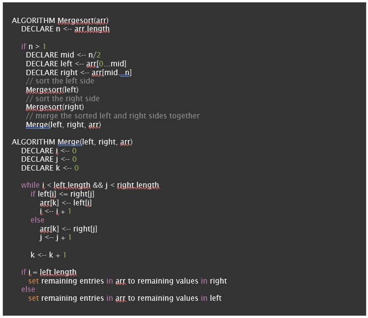
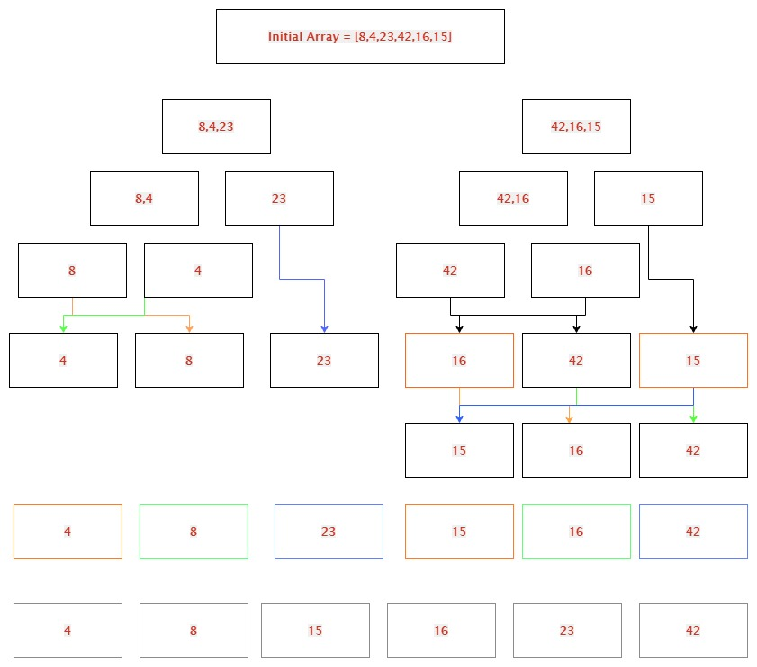

#  Merge Sort

## Definition (https://www.geeksforgeeks.org/merge-sort/)
Merge Sort is a Divide and Conquer algorithm. It divides the input array into two halves, calls itself for the two halves, and then merges the two sorted halves. The merge() function is used for merging two halves. The merge(arr, l, m, r) is a key process that assumes that arr[l..m] and arr[m+1..r] are sorted and merges the two sorted sub-arrays into one.
  -  Algorithm:
    -  MergeSort(arr[], l,  r) 
        1.  Find the middle point to divide the array into two halves:  
             middle m = l+ (r-l)/2 
        2.  Call mergeSort for first half:   
             Call mergeSort(arr, l, m) 
        3.  Call mergeSort for second half:
             Call mergeSort(arr, m+1, r)
        4.  Merge the two halves sorted in step 2 and 3:
             Call merge(arr, l, m, r)
        -  Example:
        

##  Trace
Input array 1 = [8,4,23,42,16,15]

## Efficiency

Time:  T(n) = 2T(n/2) + θ(n)
Space:  O(n)