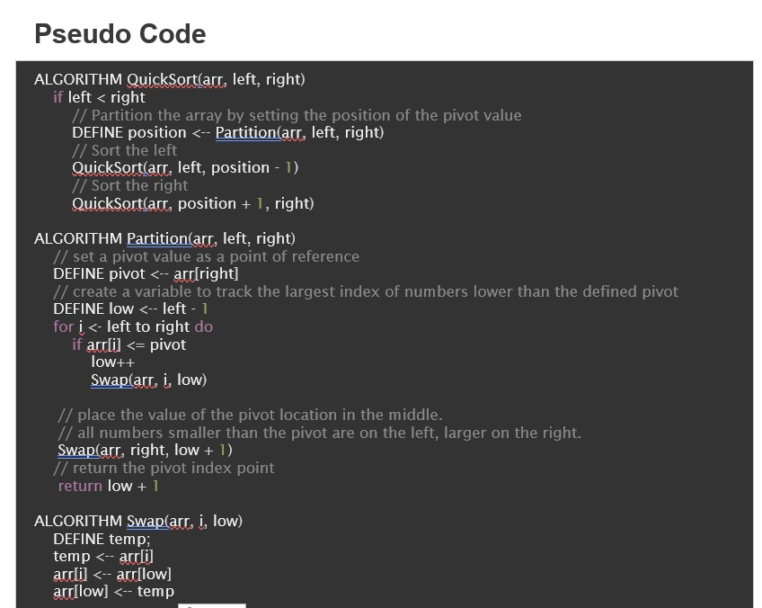
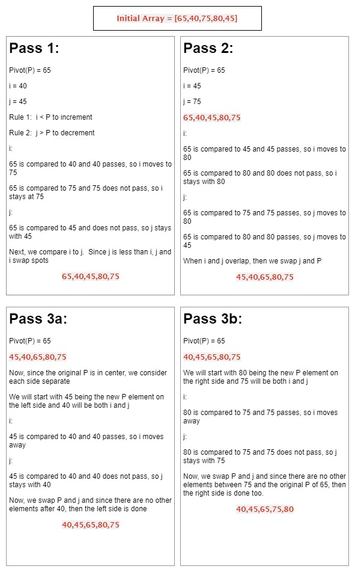

#  Quick Sort

## Definition (https://www.geeksforgeeks.org/quick-sort/)
QuickSort is a Divide and Conquer algorithm. It picks an element as pivot and partitions the given array around the picked pivot. There are many different versions of quickSort that pick pivot in different ways. 
1.  Always pick first element as pivot. 
2.  Always pick last element as pivot (implemented below) 
3.  Pick a random element as pivot.
4.  Pick median as pivot.

The key process in quickSort is partition(). Target of partitions is, given an array and an element x of array as pivot, put x at its correct position in sorted array and put all smaller elements (smaller than x) before x, and put all greater elements (greater than x) after x. All this should be done in linear time.
-  Example:

##  Trace
Input array 1 = [8,4,23,42,16,15]

## Efficiency

Time:   T(n) = T(k) + T(n-k-1) + \theta(n)
Space:  O(Log n) 